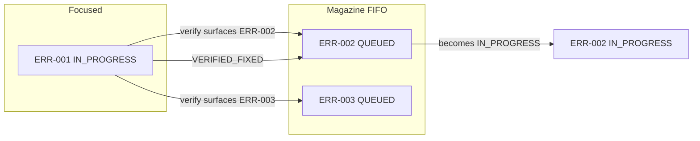

# Continuous error tracking — principles and process

This document defines **how** we track and fix errors on the FusionFall mission patch work. It complements the living logs:

| File | Role |
|------|------|
| [`ACTIVE-ERROR-QUEUE.md`](ACTIVE-ERROR-QUEUE.md) | **Magazine** — ordered list of open errors (operational) |
| [`patches/cnMissionManager-forcecomplete/ERROR-TRACKER.md`](patches/cnMissionManager-forcecomplete/ERROR-TRACKER.md) | Evidence, status dashboard, log excerpts |
| [`patches/cnMissionManager-forcecomplete/PATCH-ERROR-LOG.md`](patches/cnMissionManager-forcecomplete/PATCH-ERROR-LOG.md) | Permanent record of mistakes and root causes |
| [`STRICT-RULES.md`](STRICT-RULES.md) | **Deploy/load hard rules** — amend before repeating failed paths |
| [`docs/missions/MISSION-CATALOG.md`](docs/missions/MISSION-CATALOG.md) | **Per-mission table data** — 747 missions, 2866 tasks |
| [`docs/MISSION-EXECUTION-LOGIC.md`](docs/MISSION-EXECUTION-LOGIC.md) | Generic receive/start/complete logic (applies to all missions) |

---

## 1. Problem this solves

Under reactive debugging:

1. You fix error **A** and run a verification test.
2. The test surfaces error **B**.
3. Attention shifts entirely to **B**. The hypothesis, partial fix, and verification plan for **A** are dropped or conflated with **B**.
4. Fixing **B** surfaces **C**. The cycle repeats.
5. Nothing is fully closed; regressions go unnoticed; daily reports claim progress on different bundles.

**Continuous error tracking** means: every error gets a durable record, a strict order of work, and a verification gate before it leaves the queue. New errors do not cancel old ones—they wait their turn.

---

## 2. Core concepts

### 2.1 Focused error (one at a time)

Exactly **one** error may be `IN_PROGRESS` at any time. That error owns:

- Current hypothesis
- Files / bundle hash under test
- Verification steps not yet run
- Links to log lines and commits

No other error is “actively fixed” until the focused error is **closed** or **parked** (see §5).

### 2.2 Magazine queue (FIFO)

Errors discovered while the focused error is open are **enqueued** in **first-in, first-out** order—the “magazine”:

```
[ ERR-002 ] → [ ERR-003 ] → [ ERR-004 ]   ← tail (newest enqueue)
     ↑
  next up after ERR-001 closes
```

**Enqueue rule:** When error **B** appears during work on focused error **A**, append **B** to the magazine. **Do not** switch focus to **B**.

**Dequeue rule:** When **A** is `VERIFIED_FIXED`, the next focused error is the **head** of the magazine—the earliest error still `QUEUED` that was recorded while **A** (or the prior chain) was open. Not the newest error. Not the loudest error.

### 2.3 Error card

Every error gets a stable ID (`ERR-###`) and a card with:

| Field | Required | Description |
|-------|----------|-------------|
| **ID** | Yes | `ERR-001`, monotonic |
| **Title** | Yes | One line, symptom |
| **State** | Yes | See §4 |
| **Requirement** | Yes | Which client requirement (timer / Fusion Lair / load / other) |
| **Discovered** | Yes | ISO date; log timestamp if available |
| **Discovered while** | Yes | `ERR-xxx` focused, or `initial intake` |
| **Evidence** | Yes | Log lines, screenshot, repro steps |
| **Hypothesis** | When in progress | What we think is wrong |
| **Fix attempt** | Per attempt | What changed; bundle hash; script run |
| **Verification** | Before close | Exact pass criteria (see §6) |
| **Closed** | When fixed | Date; verifying log excerpt |

### 2.4 Separation of concerns

| Activity | Where it goes |
|----------|----------------|
| Order of work, focus, queue position | `ACTIVE-ERROR-QUEUE.md` |
| Detailed diagnosis and log archaeology | `ERROR-TRACKER.md` |
| “We must never do X again” | `PATCH-ERROR-LOG.md` |
| **Specific mission/task behavior** | `docs/missions/catalog/MISSION-{id}.md` |

Do not duplicate long log dumps in the queue file—link to `ERROR-TRACKER.md` sections.

### 2.5 Mission documentation lookup (mandatory on mission errors)

Every mission failure involves a **mission ID** and **task ID** from the log:

```
active task id : {task} mission id : {mission} slot : {0-8}
ProcessEndFail : {task} Error Code : {code}
Fail Outgoing Task : {failOutgoingTask}
```

**Before hypothesizing or patching**, resolve the table row:

| Step | Action |
|------|--------|
| 1 | Read `mission id` and `active task id` (or `ProcessEndFail` task) from the log |
| 2 | Open **`docs/missions/catalog/MISSION-{mission}.md`** — task index, chain edges, instance/timer flags, kill quotas, NPCs, packets |
| 3 | If the mission is unknown or the catalog is stale, regenerate: `python tools/export-mission-catalog.py` |
| 4 | Cross-check generic flow in **`docs/MISSION-EXECUTION-LOGIC.md`** only where the catalog doc does not answer the question |

**On every error card** record:

- `Mission ID` / `Task ID` (from log)
- `Mission doc` — link to `catalog/MISSION-{id}.md`
- `Table fields in scope` — e.g. `m_iRequireInstanceID`, `m_iFOutgoingTask`, `m_iSTGrantTimer` (from the doc, not guessed)

Do not close a mission error without confirming the failure mode matches the **documented** task row (instance gate, timer gate, fail-outgoing chain, kill quota, etc.).

---

## 3. Workflow (step by step)

### Phase A — Discovery

1. Observe a failure (test, client report, CI, staging gate).
2. If it is a **new** symptom or root cause, assign `ERR-###` and create a card in `ACTIVE-ERROR-QUEUE.md`. For mission/task failures, fill **Mission ID**, **Task ID**, and link **Mission doc** (§2.5) on the card immediately.
3. If the magazine is **empty** and nothing is `IN_PROGRESS`, set the new error to `IN_PROGRESS` (it becomes focused).
4. If something is already `IN_PROGRESS`, set the new error to `QUEUED` and note **Discovered while: ERR-xxx**.

### Phase B — Focused fix loop

For the focused error only:

1. **Reproduce** — same bundle hash, same mission/server steps documented on the card.
2. **Look up mission doc** — `catalog/MISSION-{id}.md` for the failing task; note table fields on the card (§2.5).
3. **Hypothesize** — one primary theory grounded in the mission doc + `MISSION-EXECUTION-LOGIC.md`; optional secondary listed but not acted on in parallel.
4. **Change** — minimal diff; record files, commands, output hash.
5. **Stage** — staging DLL / ingest only; never skip gates (see `OPERATING-RULES.md`).
6. **Verify** — run the card’s verification checklist (§6); re-read mission doc if behavior still mismatches table.

During step 5, if a **different** failure appears:

- Append new `ERR-###` as `QUEUED`.
- Note discovery on the focused card: “During verify: surfaced ERR-xxx”.
- **Return to the focused error** unless the new failure is a **hard stop** (§5.2).

### Phase C — Close or park

- **VERIFIED_FIXED** — verification checklist passed; move card to “Closed” section with evidence; remove from magazine head.
- **PARKED** — blocked on external input (client file, network, tool bug); magazine may advance only if lead agrees; reason mandatory.

### Phase D — Advance magazine

1. Promote head of `QUEUED` to `IN_PROGRESS`.
2. Before coding, **re-read** that error’s evidence and confirm the bundle hash still matches (client may have sent `main 2.unity3d` etc.).
3. Do not skip queue entries because a newer error seems easier.

---

## 4. Error states

| State | Meaning |
|-------|---------|
| `QUEUED` | In magazine; waiting |
| `IN_PROGRESS` | Focused; only one allowed |
| `VERIFYING` | Fix applied; running verification checklist |
| `VERIFIED_FIXED` | Closed successfully |
| `PARKED` | Blocked; documented owner and unblock condition |
| `REGRESSED` | Was `VERIFIED_FIXED`; failure returned—see §5.1 |
| `WONT_FIX` | Out of scope; client sign-off required |

---

## 5. Exceptions to strict FIFO

### 5.1 Regression (default: jump queue)

If a `VERIFIED_FIXED` error reproduces on the **same bundle hash** and test plan:

1. Re-open as new `ERR-###` with `REGRESSED` and link to original.
2. Promote it to `IN_PROGRESS` **immediately**—it preempts the magazine. FIFO applies among *new* discoveries, not among resurrected bugs.

### 5.2 Hard stop (safety)

Promote a queued error to `IN_PROGRESS` immediately only if:

- Game **does not load** (black screen, stuck at `CreateGameMode:1`), or
- Deploy would **corrupt** the only client bundle, or
- Verification cannot run at all.

Record why FIFO was broken on the card.

### 5.3 Duplicate

Same root cause as an open card → merge into existing `ERR-###`; do not create a second queue entry.

---

## 6. Verification checklist (before `VERIFIED_FIXED`)

Every error card must define pass criteria. Minimum by category:

### Game load

- [ ] `CreateGameMode:2` (or in-world) within 30s of Connect
- [ ] `Resources base url` after `assetInfo.php`
- [ ] Bundle hash matches card

### Mission autocomplete (any mission)

- [ ] Client bundle is **client’s** build (`ClientMod` / agreed base), not overwritten by DonorCompile-only deploy
- [ ] Mission doc consulted: `catalog/MISSION-{id}.md` — task chain and table fields recorded on card
- [ ] One hotkey test; log excerpt attached with `mission id` and `active task id`
- [ ] No unexpected `Fail Outgoing Task` during active chain (compare to doc § Chain edges)
- [ ] Instance/timer/kill-quota behavior matches documented task row; outcome documented

### Mission autocomplete (504: 466→468→463 — primary test case)

- [ ] [`catalog/MISSION-504.md`](docs/missions/catalog/MISSION-504.md) — task 463: instance **12**, enemy **2513 ×4**, fail → **466**
- [ ] No `Fail Outgoing Task : 466` during active chain (if in scope)
- [ ] Task 463: `ProcessEndFail err 1` handled per design (retry / `bError` / warp)—state outcome documented

### Timer missions

- [ ] Mission doc consulted — `m_iSTGrantTimer` / `m_iCSUCheckTimer` from `catalog/MISSION-{id}.md`
- [ ] Timer zeroed or deferred; no “return to NPC” / error 1 without retry path
- [ ] Log shows defer or `RequestForceCompleteTaskEnd` path

### Deploy / tooling

- [ ] `verify-il` / `verify-load-safe` / size gate passed
- [ ] `launch-patched-client.bat` + manifest hash recorded

**No card closes on “seems fine”—only on checked boxes and log proof.**

---

## 7. Rules for agents and humans

1. **One focus** — Never fix two errors in one undifferentiated changeset.
2. **Enqueue, don’t pivot** — New error during verify → queue entry, not context switch.
3. **FIFO after close** — Next work item is magazine head, not latest Discord message.
4. **Bundle hash on every card** — `main.unity3d` size + SHA256; client `main 2.unity3d` vs archive must be explicit.
5. **No silent overwrite** — Ingest client bundle before patch; do not deploy SAFE rebuild on top of `ClientMod` without explicit card.
6. **Daily report ties to ERR-###** — “Worked on ERR-002” not “made progress on main.”
7. **Close before celebrate** — `VERIFIED_FIXED` requires checklist; move diagnosis to `ERROR-TRACKER.md`.
8. **Mistake → PATCH-ERROR-LOG** — Process failures (wrong base, skipped gate) are logged permanently.
9. **Mission doc first** — On any mission/task failure, open `catalog/MISSION-{id}.md` before guessing table fields or chain behavior.

---

## 8. Daily rhythm

| When | Action |
|------|--------|
| Start of session | Read `ACTIVE-ERROR-QUEUE.md`; confirm focused error and bundle hash |
| After each test | Update focused card; enqueue new failures |
| End of session | No error left `IN_PROGRESS` without note; if mid-fix, state “next step” on card |
| Client report | Focused `ERR-###`, queue depth, one closed item with evidence max |

---

## 9. Magazine diagram



---

## 10. Template — new error card

Copy into [`ACTIVE-ERROR-QUEUE.md`](ACTIVE-ERROR-QUEUE.md):

```markdown
### ERR-### — [short title]

| Field | Value |
|-------|-------|
| State | QUEUED / IN_PROGRESS / VERIFYING |
| Requirement | timer / Fusion Lair / load / tooling |
| Discovered | YYYY-MM-DD |
| Discovered while | ERR-xxx / initial intake |
| Bundle | size= hash= |
| Mission ID | (from log) |
| Task ID | (from log) |
| Mission doc | [`catalog/MISSION-{id}.md`](docs/missions/catalog/MISSION-{id}.md) |

**Table fields in scope:** (from mission doc — instance, timer, fail-outgoing, quotas)

**Evidence:**
```

(paste or link)

```

**Hypothesis:**

**Fix attempts:**
| # | Date | Change | Result |

**Verification (pass = all checked):**
- [ ] ...

**Notes:**
```

---

## 11. Project-specific anchors (current)

- **Client source of truth:** `ClientFile/main 2.unity3d` → `ingest-client-bundle.bat`
- **Decompile target:** `mods/decompiled/` — never `ClientFile/`
- **Logs:** `_inspect_udp_listener/fusionfall_log.txt`
- **Customer requirements:** `client_requirement.txt`
- **Mission catalog:** `docs/missions/MISSION-CATALOG.md` → `docs/missions/catalog/MISSION-{id}.md` (747 missions; export: `python tools/export-mission-catalog.py`)
- **Generic mission logic:** `docs/MISSION-EXECUTION-LOGIC.md`
- **Primary test mission:** 504 — [`catalog/MISSION-504.md`](docs/missions/catalog/MISSION-504.md) + log analysis [`MISSION-504.md`](docs/missions/MISSION-504.md)
- **Do not** close Fusion Lair / timer items on vanilla bundle without client `ClientMod` DLL

Update this section when the canonical bundle changes.
