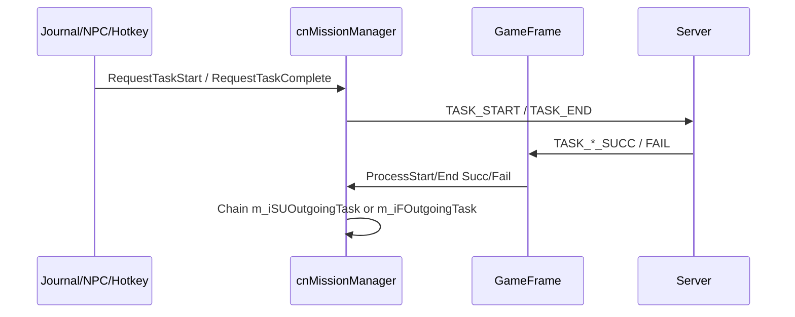

# Mission packet protocol (client ↔ server)

All packets sent via `cnEvent.SendPacket(size, opcode, struct)`.  
Opcodes from `csDefines.cs`.

---

## Client → server (CL2FE)

### `sP_CL2FE_REQ_PC_TASK_START` — opcode `318767115`, size 12

| Offset | Field | Type | Description |
|--------|-------|------|-------------|
| 0 | `iTaskNum` | int32 | `MissionElement.m_iHTaskID` |
| 4 | `iNPC_ID` | int32 | Runtime NPC instance ID (from `m_iHNPCID` table lookup), 0 if none |
| 8 | `iEscortNPC_ID` | int32 | Escort runtime ID (type 6), 0 if N/A |

**Built in:** `cnMissionManager.RequestTaskStart`  
**Log:** `Send Start Mission : {iTaskNum}`

---

### `sP_CL2FE_REQ_PC_TASK_END` — opcode `318767116`, size 16

| Offset | Field | Type | Description |
|--------|-------|------|-------------|
| 0 | `iTaskNum` | int32 | Task ID |
| 4 | `iNPC_ID` | int32 | Terminator NPC runtime ID |
| 8 | `iBox1Choice` | sbyte | Reward box 1 bit flags (journal) |
| 9 | `iBox2Choice` | sbyte | Reward box 2 bit flags |
| 10 | (pad) | | |
| 12 | `iEscortNPC_ID` | int32 | Escort runtime ID, or **-1** if `bError=true` |

**`bError=true` semantics:**

- Sets `iEscortNPC_ID = -1` unconditionally at start of build
- Used for escort death and instance warp-abort completes
- Signals server “aborted / failed complete” path

**Built in:** `cnMissionManager.RequestTaskComplete`, `cnMissionJournal.CheckComplete`, `ForceCompleteCurrentTask`

---

### `sP_CL2FE_REQ_PC_TASK_STOP` — opcode `318767122`, size 4

| Field | Description |
|-------|-------------|
| `iTaskNum` | Abandon / delete mission task |

---

### `sP_CL2FE_REQ_PC_TASK_CONTINUE` — opcode `318767123`, size 4

| Field | Description |
|-------|-------------|
| `iTaskNum` | Continue paused task |

---

### `sP_CL2FE_REQ_PC_SET_CURRENT_MISSION_ID` — opcode `318767235`, size 4

| Field | Description |
|-------|-------------|
| `iCurrentMissionID` | Selected mission group (`m_iHMissionID`) |

Sent when player changes “current mission” in journal.

---

### `sP_CL2FE_REQ_PC_TASK_COMPLETE` — opcode `318767223`, size 4

GM/debug only (`CnGuiChat`). **Not used** in normal mission flow.

---

### `sP_CL2FE_REQ_PC_MISSION_COMPLETE` — opcode `318767222`, size 4

GM/debug — full mission complete.

---

### Related: escort & barker

| Packet | Opcode | Fields |
|--------|--------|--------|
| `sP_CL2FE_REQ_NPC_GROUP_INVITE` | `318767236` | `iNPC_ID` |
| `sP_CL2FE_REQ_NPC_GROUP_KICK` | `318767237` | `iNPC_ID` |
| `sP_CL2FE_REQ_BARKER` | `318767205` | `iMissionTaskID`, `iNPC_ID` |

---

## Server → client (FE2CL)

### `sP_FE2CL_REP_PC_TASK_START_SUCC` — opcode `822083612`, size 8

| Field | Description |
|-------|-------------|
| `iTaskNum` | Task started |
| `iRemainTime` | **Grant timer seconds** (if `m_iSTGrantTimer > 0`) |

→ `GameFrame` → `cnEvent(12, 21)` → `ProcessStartSucc`

---

### `sP_FE2CL_REP_PC_TASK_START_FAIL` — opcode `822083613`, size 8

| Field | Description |
|-------|-------------|
| `iTaskNum` | Task |
| `iErrorCode` | Server rejection reason |

→ `ProcessStartFail` — common for instance start outside zone

---

### `sP_FE2CL_REP_PC_TASK_END_SUCC` — opcode `822083614`, size 4

| Field | Description |
|-------|-------------|
| `iTaskNum` | Task completed |

→ `ProcessEndSucc` → may chain `m_iSUOutgoingTask`

---

### `sP_FE2CL_REP_PC_TASK_END_FAIL` — opcode `822083615`, size 8

| Field | Description |
|-------|-------------|
| `iTaskNum` | Task |
| `iErrorCode` | **1** = most common (zone/timer/NPC rejection) |

→ `ProcessEndFail` → may restart `m_iFOutgoingTask`

---

### `sP_FE2CL_INSTANCE_MAP_INFO` — opcode `822083738`, size 60+

| Field | Description |
|-------|-------------|
| `iInstanceMapNum` | → `ownstatus.iInsMapNum` |
| `iEP_ID` | EP instance ID |
| Map coord min/max | Instance bounds |
| `iEPSwitch_StatusON_Cnt` + int array | EP ring switches |

→ Sets `bInsMap = true`

---

### Warp success — opcode `822083728`

When leaving instance (`bInsMap` was true):

→ `cnEvent(12, 29)` → `CheckWarpAllMision` → error-completes instance tasks

---

## Error code handling (`ProcessEndFail`)

| Code | Handled | Action |
|------|---------|--------|
| 1 | Yes | Fail outgoing chain |
| 12 | Yes | Same as 1 |
| 13 | Yes | System message only |
| 11 | Yes | Grouped with 1/12 |
| Other | **No** | Early return |

---

## Packet flow diagram

