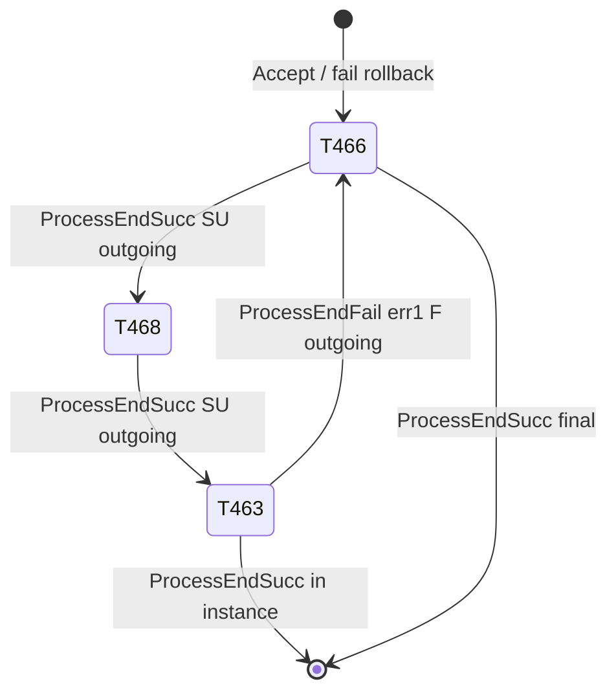

# Mission 504 — complete execution analysis

**Mission group ID:** 504 — **Practice Pranks** (Nano mission)  
**Full table doc:** [catalog/MISSION-504.md](catalog/MISSION-504.md)  
**Autocomplete test chain:** 466 → 468 → 463  
**Role in project:** Primary acceptance test for mission autocomplete patch  
**Log source:** `_inspect_udp_listener/fusionfall_log.txt` (2026-06-07)  
**Table source:** `TableData.resourceFile` → `m_pMissionTable` (extracted 2026-06-08)

---

## Summary

Mission 504 has **8 tasks** (461–465, 466, 468, 667). The autocomplete test path is **466 → 468 → 463**. Vanilla autocomplete (`ForceCompleteCurrentTask` / Right Ctrl) fails because:

1. Task **463** requires **instance 12** (`m_iRequireInstanceID=12`); server rejects complete outside zone → **error 1**
2. Task **463** requires killing **enemy 2513 ×4** before `TASK_END` is valid
3. `m_iFOutgoingTask=466` on tasks **463** and **667** → `ProcessEndFail` restarts **466** (visible loop in logs)
4. No timer fields on any task in this mission (`m_iSTGrantTimer` / `m_iCSUCheckTimer` = 0)

There is **no** hardcoded `504` or `466` in `cnMissionManager.cs` — behavior is entirely from `MissionElement` table row values.

---

## Task chain (table-verified)

| Task ID | Type | Instance | Success → | Fail → | Terminator NPC | Notes |
|---------|------|----------|-----------|--------|----------------|-------|
| 461 | Talk | — | 462 | — | 795 | Entry branch |
| 462 | GotoLocation | — | 466 | — | 1099 | Merges into 466 |
| 464 | Delivery | — | 465 | — | 795 | Alt branch |
| 465 | Defeat | — | 466 | — | — | Merges into 466 |
| **466** | GotoLocation | — | **468** | — | 1471 | **Fail restart target** |
| **468** | GotoLocation | — | **463** | — | 1470 | Mid-chain |
| **463** | Defeat | **12** | 667 | **466** | — | **Instance kill task** (enemy 2513 ×4) |
| 667 | Defeat | 12 | — | 466 | — | Post-463 instance task |

**Success chain (test path):** 466 `m_iSUOutgoingTask=468` → 468 `m_iSUOutgoingTask=463`  
**Fail chain:** 463 `m_iFOutgoingTask=466`; 667 `m_iFOutgoingTask=466`

---

## Task chain (log-observed subset)

| Order | Task ID | Role | Evidence |
|-------|---------|------|----------|
| 1 | **466** | Chain entry / restart point on fail | `Fail Outgoing Task : 466`, `ProcessStartSucc : 466` |
| 2 | **468** | Mid-chain task | `active task id : 468 mission id : 504`, `ProcessStartFail tasknum : 468` |
| 3 | **463** | Instance-zone task | `ProcessStartSucc : 463`, `ProcessEndFail : 463 Error Code : 1` |

---

## Log timeline (vanilla / broken autocomplete)

```
active task id : 468 mission id : 504 slot : 0
ProcessStartFail tasknum : 468          ← prior step ended; server starts next
Send Start Mission : 463
ProcessStartSucc : 463                  ← task 463 active
ProcessEndFail : 463 Error Code : 1     ← complete rejected (outside instance)
Fail Outgoing Task : 466                ← ProcessEndFail → RequestTaskStart(466)
Send Start Mission : 466
ProcessStartSucc : 466
ProcessStartFail tasknumber : 463       ← parallel start fail for 463
```

### Interpretation

| Step | Code path |
|------|-----------|
| 463 start succeeds | Server accepts `TASK_START` (start allowed outside instance) |
| Immediate end fail | Client or server triggered `TASK_END` for 463 without `bError=true` |
| Error 1 | Server: player not in required instance / timer / NPC gate |
| Fail outgoing 466 | `ProcessEndFail` lines 2026–2032: `RequestTaskStart(m_iFOutgoingTask)` |
| Loop | Autocomplete retries → same fail → restart 466 |

---

## Per-task execution requirements

### Task 466

| Aspect | Expected behavior |
|--------|-------------------|
| **Receive** | Active after fail rollback or initial chain entry |
| **Start packet** | `TASK_START { iTaskNum: 466, iNPC_ID: runtime or 0 }` |
| **Complete** | `TASK_END { iTaskNum: 466, bError: false }` when conditions met |
| **On fail of later task** | Becomes **restart target** (`m_iFOutgoingTask` from 463) |

**Completion command format:**
```
sP_CL2FE_REQ_PC_TASK_END
  iTaskNum = 466
  iNPC_ID  = terminator NPC runtime ID (if m_iHTerminatorNPCID > 0)
  iEscortNPC_ID = escort runtime or 0
  iBox1Choice = 0, iBox2Choice = 0
```

### Task 468

| Aspect | Expected behavior |
|--------|-------------------|
| **Chain in** | `m_iSUOutgoingTask` from 466 on 466's `ProcessEndSucc` |
| **Start** | Auto `RequestTaskStart(468, 0)` after 466 completes |
| **Complete** | Standard `TASK_END` |
| **Chain out** | On success → auto-start **463** |

Log shows `ProcessStartFail tasknum : 468` when chain is disrupted mid-autocomplete.

### Task 463 (instance / Fusion Lair class)

| Aspect | Expected behavior |
|--------|-------------------|
| **Table flag** | `m_iRequireInstanceID > 0` (inferred — matches instance patch category) |
| **Tutorial hook** | `ProcessStartSucc` calls `cnFirstUseSysManager.CheckCondition(18)` when `iTaskNum == 463` |
| **Start outside instance** | May succeed (`ProcessStartSucc : 463`) — server allows start |
| **Complete outside instance** | **Fails** — `ProcessEndFail : 463 Error Code : 1` |
| **Correct complete inside instance** | `TASK_END` with `bError=false` while `bInsMap && iInsMapNum` matches server |
| **Warp out while active** | `CheckWarpAllMision` → `TASK_END` with **`bError=true`**, `iEscortNPC_ID=-1` |

**Vanilla autocomplete mistake:**
```
ForceCompleteCurrentTask → TASK_END(463, bError=false)  // WRONG outside instance
```

**Required for patch / manual fix:**
```
TASK_END(463, bError=true)   // OR complete only after INSTANCE_MAP_INFO received
```

**Completion command (success path, in instance):**
```
sP_CL2FE_REQ_PC_TASK_END
  iTaskNum = 463
  iNPC_ID  = 0 or terminator runtime ID
  iEscortNPC_ID = 0 (or -1 if aborted)
  bError semantics via iEscortNPC_ID=-1 only when bError flag set in code
```

---

## State machine (mission 504)



---

## Server packets expected (patched acceptance)

One **Right Ctrl** with working `ForceCompleteV2` patch should produce:

```
ForceCompleteV2: start chain task 466
ForceCompleteV2: request end 466
ForceCompleteV2: advance to task 468
...
ForceCompleteV2: instance zone complete task 463   ← instance fix
ForceCompleteV2: chain finished
```

**Must NOT appear during active force-complete chain:**
```
Fail Outgoing Task : 466
```

---

## Related client code

| Concern | Location |
|---------|----------|
| Task 463 tutorial | `ProcessStartSucc` — `CheckCondition(18)` |
| Fail outgoing | `ProcessEndFail` — `m_iFOutgoingTask` |
| Success chain | `ProcessEndSucc` — `m_iSUOutgoingTask` |
| Instance warp abort | `CheckWarpAllMision` |
| Autocomplete | `ForceCompleteCurrentTask` |
| Hotkey | `cnAvatarAttack` key **305** |

---

## Verification checklist

- [ ] Login shows `active task id : 466 mission id : 504` (or chain step)
- [ ] One autocomplete action advances 466→468→463 without `Fail Outgoing Task : 466`
- [ ] Task 463 either completes in instance OR uses designed `bError` retry
- [ ] Bundle hash recorded on test card (`ACTIVE-ERROR-QUEUE.md` ERR-001)

---

*See also: `../../patches/cnMissionManager-forcecomplete/ERROR-TRACKER.md`, `../../ACTIVE-ERROR-QUEUE.md` ERR-001*
