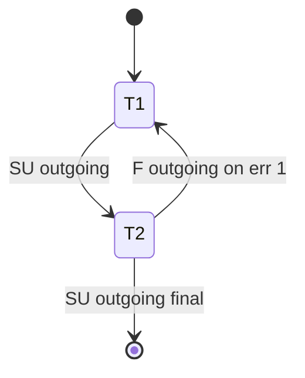

# Mission {MISSION_ID} — {MISSION_NAME}

**Table source:** `MissionTableScript.m_pMissionData` (TableContainer index 7)  
**Documented:** YYYY-MM-DD  
**Test log:** `_inspect_udp_listener/fusionfall_log.txt` (session date)

---

## Overview

| Field | Value |
|-------|-------|
| Mission ID | `{m_iHMissionID}` |
| Mission type | Guide / Nano / Normal (`m_iHMissionType`) |
| Task count | N |
| Timer mission? | `m_iSTGrantTimer` / `m_iCSUCheckTimer` |
| Instance mission? | `m_iRequireInstanceID` |

---

## Task list

| Order | Task ID | Type | Instance ID | Grant timer | Outgoing (SU) | Fail outgoing (F) |
|-------|---------|------|-------------|-------------|---------------|-------------------|
| 1 | | | | | | |
| 2 | | | | | | |

---

## Task {TASK_ID} — detail

### MissionElement fields

```
m_iHTaskID:
m_iHTaskType:
m_iHNPCID:
m_iHTerminatorNPCID:
m_iRequireInstanceID:
m_iSTGrantTimer:
m_iCSUCheckTimer:
m_iSUOutgoingTask:
m_iFOutgoingTask:
m_iCSUEnemyID: [,,]
m_iCSUItemID: [,,]
```

### How player receives this task

- [ ] Journal accept from NPC `{npcId}`
- [ ] Email offer
- [ ] Auto-chain from task `{prevTask}` on `ProcessEndSucc`
- [ ] Fail rollback from task `{otherTask}` on `ProcessEndFail`

### How player must complete

- [ ] Talk to NPC
- [ ] Reach location
- [ ] Kill enemies
- [ ] Collect items
- [ ] Escort NPC
- [ ] Wait timer
- [ ] Enter instance `{instanceId}`

### Client completion command

```
sP_CL2FE_REQ_PC_TASK_END (opcode 318767116)
  iTaskNum =
  iNPC_ID =
  iEscortNPC_ID =
  iBox1Choice = 0
  iBox2Choice = 0
  bError = false / true (see MISSION-PACKET-PROTOCOL.md)
```

### Server responses (from test log)

```
(paste ProcessStartSucc / ProcessEndFail lines)
```

### Autocomplete notes

- Vanilla hotkey (305): expected fail mode?
- Patch required: timer defer / instance bError / chain guard

---

## Chain diagram



---

## Verification

- [ ] Manual complete works
- [ ] Autocomplete (Right Ctrl) works with patch
- [ ] No `Fail Outgoing Task` loop
